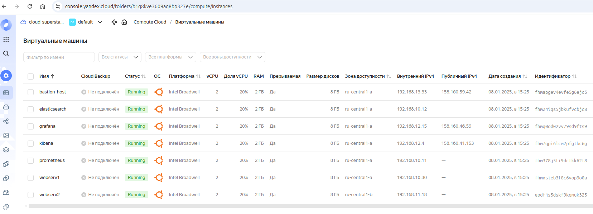
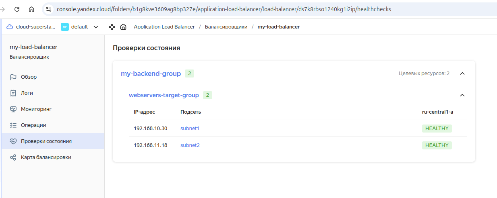
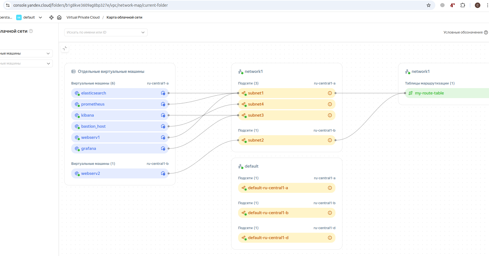
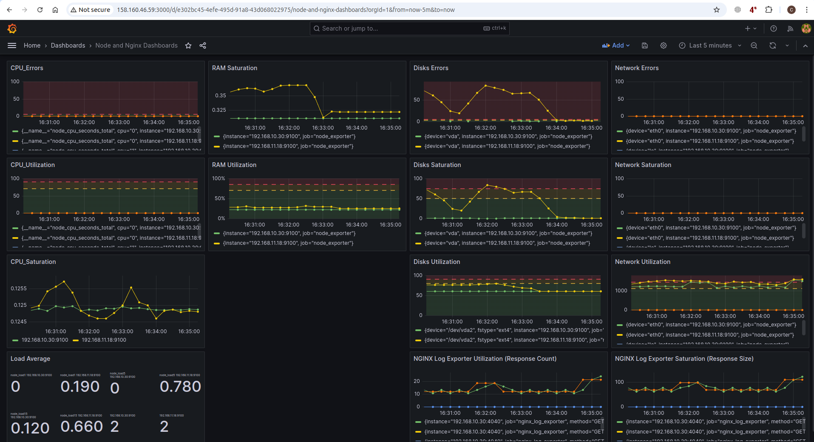
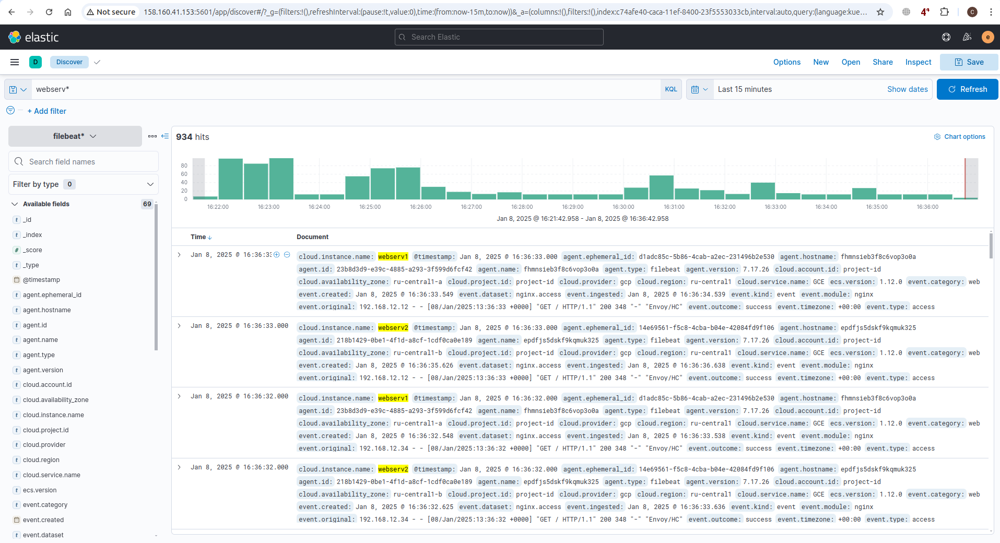
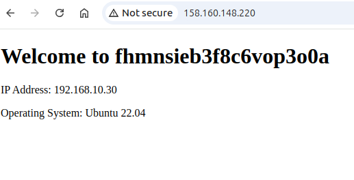
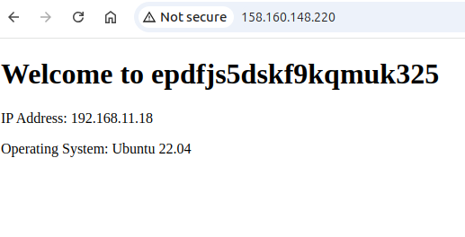

# kurs-devops

### Настройка для работы:  
- Создание и настройка инфраструкты происходит по запуску terraform (terraform apply) из terraform происходит в частности и запуск плейбуков ansible
- Для работы необходимо указать данные в файле terraform.tfvars: yandex_cloud_token, elastic_passwd и grafana_passwd
- В файле user-data.yaml необходимо указать публичный ключ, а в папку ansible положить соответствующий приватный ключ и указать его имя в ansible.cfg
- Для входа в grafana пользователь - admin, kibana - elastic
- На всех ВМ пользователь - stas

### Дополнительные настройки:  
- В файле variables.tf можно настроить характеристики ВМ
- Также variables.tf можно ужесточить политику безопасности, но только после создания всей инфраструктуры, для этого нужно для Переменной управления средой применить default = true и снова запустить terraform apply
- При создании ВМ в файле main.tf можно использовать статические IP. Для этого нужно добавить ключ для IP в locals и раскоментировать ip_address = each.value.ip в блоке network_interface

### Результаты работы:
Работающая инфраструктура рассходует денежные средства, поэтому представляю только данные о ее работе.  
Если в ходе провери задания потребуется показать работу, то развертка занимает не дольше 10 минут и может быть осуществлена по предварительной договоренности.  

Лог создания ресурсов terraform и настройки ansible представлен в файле:  
[worklog](results/worklog)  

Скриншоты:

